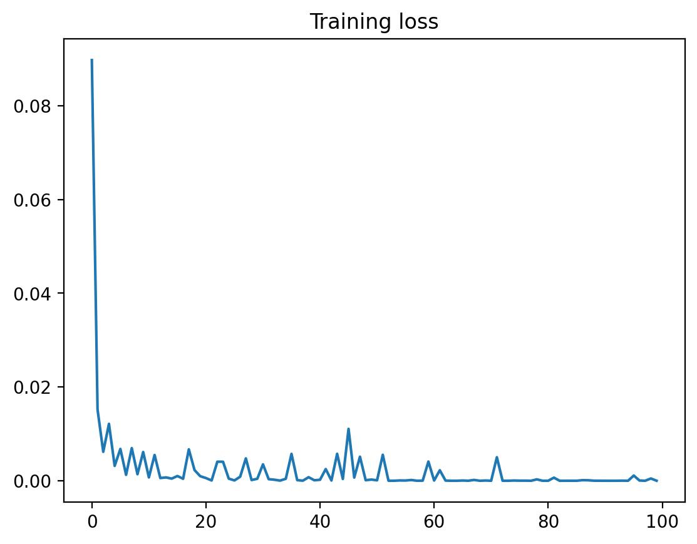

# Repositorio MNIST

Este repositorio contiene una implementación del famoso problema del conjunto de datos MNIST en Python. MNIST es un conjunto de datos ampliamente utilizado en el campo de la visión por computadora y el aprendizaje automático. Consiste en un conjunto de 60,000 imágenes de dígitos escritos a mano para entrenamiento y 10,000 imágenes adicionales para pruebas.

El objetivo principal de este repositorio es proporcionar una implementación clara y comprensible del problema de MNIST, utilizando herramientas y bibliotecas populares de Python, como NumPy, Pandas y Pytorch.

Para entrenar el modelo utilizaremos redes neuronales. 

## Ejecución 

Podemos encontrar la estructura de la red en el archivo **nn.py**. Para ejecutar el programa tienes que ejecutar el archivo **main.py** y desde ahí te preguntará si deseas relizar un entrenamiento o directamente cargar un modelo ya entrenado. 

Podemos observar como el error se minimiza a lo largo del entrenamiento.

